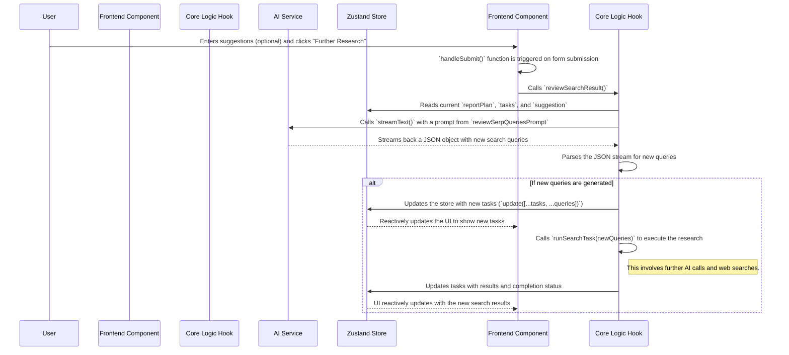
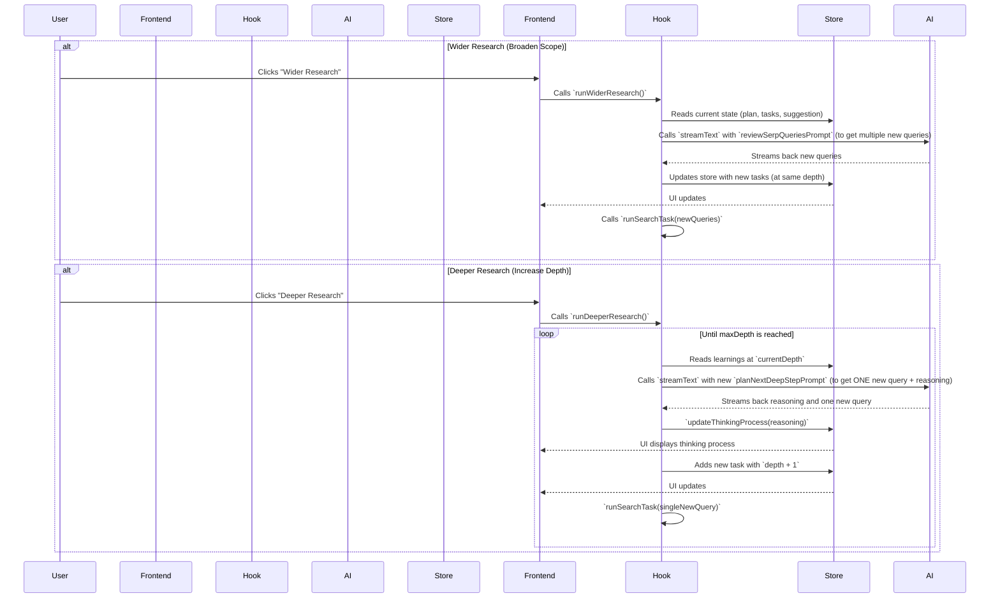

Here is a sequence diagram illustrating the interaction between the different parts of the system.

## Detailed Breakdown
-   **Role**: It acts as the single source of truth for the application's state. When `reviewSearchResult` receives new tasks, it calls `taskStore.update()` to add them to the state. React components like `SearchResult.tsx` subscribe to this store and automatically re-render when the state changes, thus displaying the new tasks and their results in real-time.

## Modification Proposal: Wider/Deeper Research

This section outlines the planned modifications to implement the "Wider" and "Deeper" research functionalities. This will serve as the blueprint for the development process.

### 1. High-Level Design

The single "Further Research" button will be replaced by two distinct buttons:
- **Wider Research**: Manually triggered, broadens the research scope at the current depth.
- **Deeper Research**: Manually triggered, initiates an automated, multi-step process to dig deeper into a topic until a `maxDepth` is reached.

### 2. Updated Workflow Diagram

### 3. Planned Code Changes

Here is a checklist of changes for each file involved.

#### **`src/types.d.ts`**
- [ ] In `SearchTask` interface, add `depth: number;`.

#### **`src/store/task.ts`**
- [ ] Add `maxDepth: number;` to `TaskStore` interface (default to `3` for now).
- [ ] Add `thinkingProcess: string;` to `TaskStore` interface.
- [ ] Add `setMaxDepth: (depth: number) => void;` to `TaskFunction` interface and implement it.
- [ ] Add `updateThinkingProcess: (text: string) => void;` to `TaskFunction` interface and implement it.
- [ ] Modify `update` and `updateTask` to handle the new `depth` property correctly when creating/updating tasks.

#### **`src/components/Research/SearchResult.tsx`**
- [ ] Replace the single `<Button type="submit">` with two new buttons: "Wider Research" and "Deeper Research".
- [ ] The buttons will be standard buttons, not form submission buttons.
- [ ] Create new handlers `handleWiderResearch` and `handleDeeperResearch` for the button clicks. These will call the respective functions from the `useDeepResearch` hook.
- [ ] Add a new UI section that conditionally renders based on `isThinkingDeeper` state.
- [ ] This new section will display the `thinkingProcess` text from the `taskStore`, providing real-time feedback to the user during the Deeper Research process.

#### **`src/hooks/useDeepResearch.ts`**
- [ ] Rename `reviewSearchResult` to `runWiderResearch`. Its logic will remain largely the same, but it must ensure new tasks are assigned the correct `depth`.
- [ ] Create a new `async` function `runDeeperResearch`.
- [ ] This function will contain a `while` loop that continues as long as `currentDepth < maxDepth`.
- [ ] Inside the loop, it will:
    1.  Call a new prompt-generating function `planNextDeepStepPrompt`.
    2.  Call `streamText` to get the AI's reasoning and the single next query.
    3.  Update the store with the reasoning using `updateThinkingProcess`.
    4.  Add the new, deeper task to the store.
    5.  Execute the task using `runSearchTask`.
- [ ] Export the new `runWiderResearch` and `runDeeperResearch` functions from the hook.

#### **`src/utils/deep-research/prompts.ts`**
- [ ] Keep the existing `reviewSerpQueriesPrompt` for the "Wider Research" functionality.
- [ ] Create a new exported function `planNextDeepStepPrompt`.
- [ ] This function will take the learnings from the previous depth level as input.
- [ ] It will generate a new prompt instructing the AI to first synthesize the provided information and then formulate a single, strategic next query to deepen the research, returning the output in a structured JSON format (`{ "reasoning": "...", "query": "..." }`).
- [ ] A corresponding Zod schema for this new JSON output will also be needed.
 