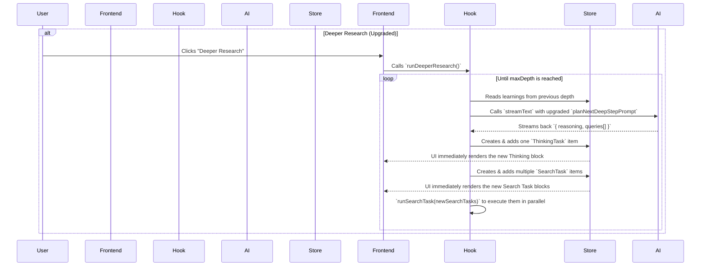

# "Further Research" Feature Workflow Analysis

This document outlines the complete workflow of the "Further Research" feature in the Deep Research application. It serves as a technical reference for future development and modifications.

## High-Level Overview

The "Further Research" feature enables an iterative, AI-driven research process. It is split into two modes: "Wider Research" to broaden the scope, and "Deeper Research" to dig deeper into topics.

## Modification Proposal 2.0: Thinking as a First-Class Citizen

This section outlines the planned modifications to elevate the "Deeper Research" functionality. The core idea is to treat the AI's "thinking" process as a persistent, reviewable item, and to enable concurrent sub-tasks for more efficient research.

### 1. Core Architectural Change: The `ResearchItem`

We will introduce a discriminated union type called `ResearchItem` to represent all entries in the research timeline. This is the foundation of our new design.

- **`ThinkingTask`**: A new type representing the AI's decision-making process at each depth level. It will contain the AI's reasoning.
- **`SearchTask`**: The existing task type, representing an executable search query.
- **State Store (`task.ts`)**: The main `tasks` array will be changed from `SearchTask[]` to `ResearchItem[]`.

### 2. Updated Workflow Diagram

The "Wider Research" flow remains unchanged. The "Deeper Research" flow is upgraded:

```mermaid
sequenceDiagram
    participant User
    participant SearchResult.tsx as Frontend
    participant useDeepResearch.ts as Hook
    participant AI_Service as AI
    participant taskStore as Store

    alt Deeper Research (Upgraded)
        User->>Frontend: Clicks "Deeper Research"
        Frontend->>Hook: Calls `runDeeperResearch()`
        loop Until maxDepth is reached
            Hook->>Store: Reads learnings from previous depth
            Hook->>AI: Calls `streamText` with upgraded `planNextDeepStepPrompt`
            AI-->>Hook: Streams back `{ reasoning, queries[] }`
            
            Hook->>Store: Creates & adds one `ThinkingTask` item
            Store-->>Frontend: UI immediately renders the new Thinking block
            
            Hook->>Store: Creates & adds multiple `SearchTask` items
            Store-->>Frontend: UI immediately renders the new Search Task blocks
            
            Hook->>Hook: `runSearchTask(newSearchTasks)` to execute them in parallel
        end
    end
```

### 3. Planned Code Changes (Checklist)

Here is a detailed checklist of changes for each file involved.

#### **`src/types.d.ts`**
- [ ] Define a new `ThinkingTask` interface with properties: `id: string`, `type: 'thinking'`, `depth: number`, `title: string`, `reasoning: string`.
- [ ] Add `type: 'search'` to the existing `SearchTask` interface.
- [ ] Create a new exported type `ResearchItem = ThinkingTask | SearchTask;`.

#### **`src/store/task.ts`**
- [ ] Change the type of the `tasks` state from `SearchTask[]` to `ResearchItem[]`.
- [ ] Update `updateTask` and any other functions that manipulate the `tasks` array to correctly handle the `ResearchItem` union type (e.g., by finding items via `id` and using type guards).
- [ ] The `thinkingProcess` state can be deprecated or repurposed, as the reasoning will now be stored within each `ThinkingTask`.

#### **`src/components/Research/SearchResult.tsx`**
- [ ] The main `taskStore.tasks.map(...)` loop will now iterate over `ResearchItem[]`.
- [ ] Inside the loop, use a type guard (`if (item.type === 'thinking')`) to conditionally render different components.
- [ ] For `item.type === 'thinking'`, create and render a new, read-only, collapsible component (e.g., `<ThinkingBlock>`) that displays the `item.title` and `item.reasoning`.
- [ ] For `item.type === 'search'`, render the existing `AccordionItem` for `SearchTask`, which already contains all the dynamic interaction logic (edit, rerun, cancel). This ensures full compatibility.

#### **`src/hooks/useDeepResearch.ts`**
- [ ] Update `runDeeperResearch`'s core logic:
    1.  After calling the AI, it will first create a single `ThinkingTask` object and add it to the store.
    2.  It will then iterate through the `queries` array returned by the AI, create multiple `SearchTask` objects, and add them all to the store.
    3.  Finally, it will pass the array of new `SearchTask`s to `runSearchTask`.
- [ ] The `updateThinkingProcess` function can be removed as we now persist thinking tasks directly.

#### **`src/utils/deep-research/prompts.ts`**
- [ ] **Crucial Change**: Upgrade `planNextDeepStepPrompt` to instruct the AI to return a JSON object containing `reasoning: string` and `queries: Array<{ query: string, title: string, researchGoal: string }>`.
- [ ] Upgrade `getDeepStepSchema` (the Zod schema) to match this new, more complex JSON structure. It must validate an object with a `reasoning` string and a `queries` array.
