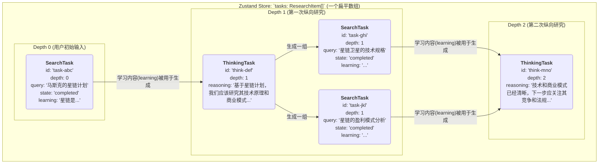

# "Further Research" 功能架构设计与实施指南

> ⚠️ **给 AI 助手的说明**：本文档是深度研究功能的完整实施指南。请严格按照文档中的步骤进行修改，每个步骤都有具体的文件路径和代码示例。

## 1. 功能概述与当前状态

### 1.1 核心需求
1. **横向扩展（Wider Research）**：在当前层添加更多搜索任务
2. **纵向深化（Deeper Research）**：自动进入下一层，执行更深入的研究
3. **自动循环**：深度研究时自动执行多层，直到达到最大深度
4. **灵活性**：任何时候都可以在当前层扩展广度
5. **可中断性**：所有任务都应该可以动态中断

### 1.2 当前代码状态评估
- ✅ 数据结构已定义（`ResearchItem = ThinkingTask | SearchTask`）
- ✅ 基本的 `runDeeperResearch` 函数已实现
- ❌ 缺少全局状态管理（容易导致并发问题）
- ❌ 缺少层级完成判断机制
- ❌ UI 组件混乱（`SearchResult.tsx` 过于复杂）

## 2. 核心架构：扁平列表与虚拟层级

在开始编码前，必须理解本方案的数据结构设计。

**核心思想**：所有任务（思考与搜索）都存储于一个扁平数组 `tasks` 中。层级关系通过每个任务的 `depth` 属性来定义，而非通过嵌套对象。


```mermaid
graph TD
    subgraph "Zustand Store: `tasks: ResearchItem[]` (一个扁平数组)"
        direction LR
        subgraph "Depth 0 (用户初始输入)"
            ST0("<b>SearchTask</b><br/>id: 'task-abc'<br/>depth: 0<br/>query: '马斯克的星链计划'<br/>state: 'completed'<br/>learning: '星链是...'")
        end

        subgraph "Depth 1 (第一次纵向研究)"
            TT1("<b>ThinkingTask</b><br/>id: 'think-def'<br/>depth: 1<br/>reasoning: '基于星链计划，我们应该研究其技术原理和商业模式...'")
            ST1_A("<b>SearchTask</b><br/>id: 'task-ghi'<br/>depth: 1<br/>query: '星链卫星的技术规格'<br/>state: 'completed'<br/>learning: '...'")
            ST1_B("<b>SearchTask</b><br/>id: 'task-jkl'<br/>depth: 1<br/>query: '星链的盈利模式分析'<br/>state: 'completed'<br/>learning: '...'")
        end

        subgraph "Depth 2 (第二次纵向研究)"
            TT2("<b>ThinkingTask</b><br/>id: 'think-mno'<br/>depth: 2<br/>reasoning: '技术和商业模式已经清晰，下一步应关注其竞争和法规...'")
        end
    end

    %% 逻辑关系
    ST0 -- "学习内容(learning)被用于生成" --> TT1;
    TT1 -- "生成一组" --> ST1_A;
    TT1 -- "生成一组" --> ST1_B;
    ST1_A & ST1_B -- "学习内容(learning)被用于生成" --> TT2;
```

- **ThinkingTask (思考任务)**: 代表AI的思考过程，它本身不执行搜索。
- **SearchTask (搜索任务)**: 代表一个具体的搜索任务。
- **关联逻辑**: `depth: N` 的思考和搜索任务，是由所有已完成的 `depth: N-1` 的搜索任务的学习成果生成的。

这种"扁平化"设计能极大简化状态更新逻辑，避免深层嵌套带来的复杂性。

## 3. 详细实施步骤

### 步骤 1：修改状态管理（`src/store/task.ts`）

**文件路径**：`src/store/task.ts`

**当前状态**：文件第 1-136 行，包含基本的 task store 定义

**需要添加的内容**（在第 17 行 `TaskStore` 接口中添加）：

```typescript
export interface TaskStore {
  // ... 现有字段（第 7-21 行）
  
  // 新增字段（在第 21 行后添加）
  researchStatus: 'idle' | 'wider-research' | 'deeper-research' | 'stopping';
  currentDepth: number;
  isAutoMode: boolean;
  removeTasksByDepth: (depth: number) => void;
}
```

**需要添加的函数**（在第 45 行 `TaskFunction` 接口中添加）：

```typescript
interface TaskFunction {
  // ... 现有函数（第 25-45 行）
  
  // 新增函数（在第 45 行后添加）
  setResearchStatus: (status: 'idle' | 'wider-research' | 'deeper-research' | 'stopping') => void;
  setCurrentDepth: (depth: number) => void;
  setAutoMode: (auto: boolean) => void;
  getTasksByDepth: (depth: number) => ResearchItem[];
  isDepthCompleted: (depth: number) => boolean;
  removeTasksByDepth: (depth: number) => void;
}
```

**在默认值中添加**（第 52 行 `defaultValues` 对象中）：

```typescript
const defaultValues: TaskStore = {
  // ... 现有默认值（第 52-67 行）
  
  // 新增默认值（在第 67 行后添加）
  researchStatus: 'idle',
  currentDepth: 0,
  isAutoMode: false,
  removeTasksByDepth: (depth) => {
    // Implementation of removeTasksByDepth
  },
};
```

**实现新函数**（在第 120 行 `reset` 函数后添加）：

```typescript
// 在第 120 行后添加
setResearchStatus: (status) => set(() => ({ researchStatus: status })),
setCurrentDepth: (depth) => set(() => ({ currentDepth: depth })),
setAutoMode: (auto) => set(() => ({ isAutoMode: auto })),
getTasksByDepth: (depth) => {
  const { tasks } = get();
  return tasks.filter(t => t.depth === depth);
},
isDepthCompleted: (depth) => {
  const { tasks } = get();
  const tasksAtDepth = tasks.filter(t => t.depth === depth);
  const searchTasks = tasksAtDepth.filter(t => t.type === 'search');
  
  if (searchTasks.length === 0) return false;
  
  return searchTasks.every(t => 
    t.state === 'completed' || 
    t.state === 'failed' || 
    t.state === 'cancelled'
  );
},
removeTasksByDepth: (depth) => {
  set((state) => ({
    tasks: state.tasks.filter((t) => t.depth !== depth),
  }));
},
```

### 步骤 2：修改 `runDeeperResearch` 函数

**文件路径**：`src/hooks/useDeepResearch.ts`

**当前位置**：第 516-590 行

**完全替换现有的 `runDeeperResearch` 函数**：

```typescript
async function runDeeperResearch() {
  const { 
    tasks, 
    maxDepth, 
    addTasks,
    researchStatus,
    setResearchStatus,
    currentDepth,
    setCurrentDepth,
    isAutoMode,
    setAutoMode,
    isDepthCompleted
  } = useTaskStore.getState();
  
  // 步骤 1：防止并发
  if (researchStatus !== 'idle') {
    console.warn('Research already in progress');
    toast.warning(t("research.common.researchInProgress"));
    return;
  }
  
  const { thinkingModel } = getModel();
  
  // 步骤 2：设置状态
  setResearchStatus('deeper-research');
  setAutoMode(true);
  
  try {
    // 步骤 3：获取当前最大深度
    let currentMaxDepth = tasks.length > 0 
      ? Math.max(...tasks.map((t) => t.depth)) 
      : 0;
    
    // 步骤 4：自动循环
    while (currentMaxDepth < maxDepth && isAutoMode) {
      setStatus(t("research.common.deeperResearch"));
      setCurrentDepth(currentMaxDepth);
      
      // 步骤 5：检查是否已有 thinking task
      const existingThinking = tasks.find(
        t => t.type === 'thinking' && t.depth === currentMaxDepth + 1
      );
      
      if (existingThinking) {
        console.warn('Thinking task already exists for depth', currentMaxDepth + 1);
        break;
      }
      
      // 步骤 6：获取当前层的学习内容
      const learningsAtCurrentDepth = tasks
        .filter((t): t is SearchTask => 
          t.type === "search" && 
          t.depth === currentMaxDepth && 
          t.state === 'completed'
        )
        .map((t) => t.learning);
      
      if (learningsAtCurrentDepth.length === 0) {
        console.warn('No completed tasks at current depth');
        break;
      }
      
      // 步骤 7：调用 AI 生成下一步计划
      const result = streamText({
        model: await createModelProvider(thinkingModel),
        system: getSystemPrompt(),
        prompt: [
          planNextDeepStepPrompt(learningsAtCurrentDepth),
          getResponseLanguagePrompt(),
        ].join("\n\n"),
        onError: handleError,
      });
      
      const deepStepSchema = getDeepStepSchema();
      let content = "";
      let deepStepResult: {
        reasoning: string;
        queries: { query: string; title: string; researchGoal: string }[];
      } | undefined;
      
      for await (const textPart of result.textStream) {
        content += textPart;
        const data: PartialJson = parsePartialJson(removeJsonMarkdown(content));
        if (
          deepStepSchema.safeParse(data.value) &&
          (data.state === "repaired-parse" || data.state === "successful-parse")
        ) {
          deepStepResult = data.value;
        }
      }
      
      if (!deepStepResult) {
        toast.error(t("research.error.aiFailedToGeneratePlan"));
        break;
      }
      
      // 步骤 8：创建 thinking task
      const thinkingTask: ThinkingTask = {
        id: nanoid(),
        type: 'thinking',
        depth: currentMaxDepth + 1,
        title: t("research.thinking.depthTitle", { depth: currentMaxDepth + 1 }),
        reasoning: deepStepResult.reasoning,
      };
      
      // 步骤 9：创建 search tasks
      const newSearchTasks: SearchTask[] = deepStepResult.queries.map(q => ({
        ...q,
        id: nanoid(),
        type: 'search' as const,
        depth: currentMaxDepth + 1,
        state: 'unprocessed' as const,
        learning: '',
        sources: [],
        images: [],
      }));
      
      // 步骤 10：添加任务到 store
      addTasks([thinkingTask, ...newSearchTasks]);
      
      // 步骤 11：执行搜索任务
      await runSearchTask(newSearchTasks);
      
      // 步骤 12：等待当前层完成
      await waitForDepthCompletion(currentMaxDepth + 1);
      
      // 步骤 13：检查是否被中断
      const { researchStatus: currentStatus } = useTaskStore.getState();
      if (currentStatus === 'stopping') {
        break;
      }
      
      // 步骤 14：移动到下一层
      currentMaxDepth++;
    }
    
    setStatus(t("research.common.researchCompleted"));
  } catch (error) {
    console.error('Deep research error:', error);
    handleError(error);
  } finally {
    // 步骤 15：重置状态
    setResearchStatus('idle');
    setAutoMode(false);
  }
}
```

**添加辅助函数**（在 `runDeeperResearch` 函数后添加）：

```typescript
// 等待某一层完成的辅助函数
async function waitForDepthCompletion(depth: number): Promise<void> {
  return new Promise((resolve) => {
    const checkInterval = setInterval(() => {
      const { isDepthCompleted, researchStatus } = useTaskStore.getState();
      
      if (researchStatus === 'stopping' || isDepthCompleted(depth)) {
        clearInterval(checkInterval);
        resolve();
      }
    }, 1000);
  });
}

// 取消深度研究的函数
async function cancelDeeperResearch() {
  const { setResearchStatus, setAutoMode, tasks } = useTaskStore.getState();
  
  setResearchStatus('stopping');
  setAutoMode(false);
  
  // 取消所有活动任务
  const activeTasks = tasks.filter(t => 
    t.type === 'search' && 
    ['processing', 'searching', 'summarizing', 'waiting'].includes(t.state)
  );
  
  for (const task of activeTasks) {
    await cancelTask(task.id);
  }
  
  setResearchStatus('idle');
}
```

### 步骤 3：修改 `runWiderResearch` 函数

**文件路径**：`src/hooks/useDeepResearch.ts`

**当前位置**：第 441-513 行

**在函数开始处添加状态检查**（第 442 行后）：

```typescript
async function runWiderResearch() {
  const { 
    reportPlan, 
    tasks, 
    suggestion,
    researchStatus,
    setResearchStatus,
    currentDepth
  } = useTaskStore.getState();
  
  // 添加状态检查
  if (researchStatus === 'deeper-research') {
    toast.warning(t("research.common.deeperResearchInProgress"));
    return;
  }
  
  setResearchStatus('wider-research');
  
  try {
    // ... 现有逻辑
  } finally {
    setResearchStatus('idle');
  }
}
```

### 步骤 4：更新 UI 组件

**文件路径**：`src/components/Research/SearchResult.tsx`

**需要修改的部分**：

1. **导入 researchStatus**（第 47 行）：
```typescript
const { tasks, suggestion, updateTask, removeTask, setSuggestion, researchStatus } = useTaskStore();
```

2. **修改按钮禁用逻辑**（第 495-520 行）：
```typescript
// 横向研究按钮
<Button
  className="w-full"
  type="button"
  variant="outline"
  disabled={isThinking || !taskFinished || researchStatus !== 'idle'}
  onClick={handleWiderResearch}
>
  {/* ... 按钮内容 */}
</Button>

// 深度研究按钮
<Button
  className="w-full"
  type="button"
  variant="default"
  disabled={isThinking || !taskFinished || researchStatus !== 'idle'}
  onClick={handleDeeperResearch}
>
  {/* ... 按钮内容 */}
</Button>
```

3. **添加全局状态显示**（在 Accordion 组件后添加）：
```typescript
{researchStatus === 'deeper-research' && (
  <div className="p-4 mt-4 mb-4 border-l-4 border-blue-500 bg-blue-50 dark:bg-gray-800 rounded-md">
    <h4 className="font-semibold text-lg mb-2 flex items-center">
      <LoaderCircle className="animate-spin mr-2" />
      {t("research.status.deeperResearchInProgress")}
    </h4>
    <p className="text-sm text-muted-foreground">
      {t("research.status.currentDepth", { depth: currentDepth })}
    </p>
    <Button
      onClick={() => {
        const { cancelDeeperResearch } = useDeepResearch();
        cancelDeeperResearch();
      }}
      variant="destructive"
      size="sm"
      className="mt-2"
    >
      {t("research.common.stopResearch")}
    </Button>
  </div>
)}
```

### 步骤 5：添加必要的导出

**文件路径**：`src/hooks/useDeepResearch.ts`

**在 return 语句中添加**（第 980 行）：

```typescript
return {
  // ... 现有导出
  cancelDeeperResearch,
  rerunDepth,
};
```

## 4. 测试要点

1. **并发控制测试**：
   - 快速连续点击"深度研究"按钮，应该只触发一次
   - 在深度研究进行中点击"横向研究"，应该显示警告

2. **层级完成测试**：
   - 删除某一层的部分任务，确认能正确判断层级完成状态
   - 取消某个任务，确认不会阻塞下一层

3. **中断测试**：
   - 在深度研究进行中点击"停止"按钮
   - 确认所有活动任务都被取消

## 5. 常见问题与解决方案

### 问题 1：ThinkingTask 没有 state 属性
**解决方案**：在 `src/types.d.ts` 中为 ThinkingTask 添加 state 属性（可选）

### 问题 2：翻译键缺失
**解决方案**：在 `src/locales/zh-CN.json` 中添加：
```json
{
  "research": {
    "common": {
      "researchInProgress": "研究正在进行中",
      "deeperResearchInProgress": "深度研究正在进行中，请稍候",
      "stopResearch": "停止研究",
      "confirmRemoveDepth": "确定要删除这一层级的所有任务吗？",
      "confirmRerunDepth": "确定要重新生成这一层级吗？当前层级的所有任务将被删除。"
    },
    "status": {
      "deeperResearchInProgress": "深度研究进行中",
      "currentDepth": "当前深度：{{depth}}"
    },
    "thinking": {
      "depthTitle": "第 {{depth}} 层思考过程"
    },
    "error": {
      "aiFailedToGeneratePlan": "AI 未能生成下一步计划",
      "noLearningForRerun": "无法重新生成，因为找不到上一层的学习内容。"
    }
  }
}
```

## 6. 架构决策说明

### 为什么选择这种设计？

1. **最小化修改**：只在必要的地方添加代码，不改变现有的核心逻辑
2. **渐进式增强**：先实现核心功能，后续可以逐步添加高级特性
3. **状态隔离**：通过 `researchStatus` 确保不同操作不会相互干扰
4. **用户友好**：提供清晰的状态反馈和中断机制

### 未来扩展点

1. **Prompt 优化**（第二阶段）：
   - 修改 `planNextDeepStepPrompt` 让 AI 看到所有历史任务
   - 添加 `shouldContinue` 判断

2. **UI 增强**（第二阶段）：
   - 为 ThinkingTask 添加进度状态
   - 可视化层级关系

3. **智能特性**（第三阶段）：
   - 任务去重
   - 优先级排序

## 7. 实施检查清单

- [ ] 步骤 1：修改 `src/store/task.ts`
- [ ] 步骤 2：修改 `src/hooks/useDeepResearch.ts` 中的 `runDeeperResearch`
- [ ] 步骤 3：修改 `src/hooks/useDeepResearch.ts` 中的 `runWiderResearch`
- [ ] 步骤 4：更新 `src/components/Research/SearchResult.tsx`
- [ ] 步骤 5：添加必要的导出和翻译
- [ ] 执行测试验证功能

---

> 💡 **提示**：请按照步骤顺序执行，每完成一个步骤后进行测试。如遇到问题，请参考"常见问题与解决方案"部分。
 