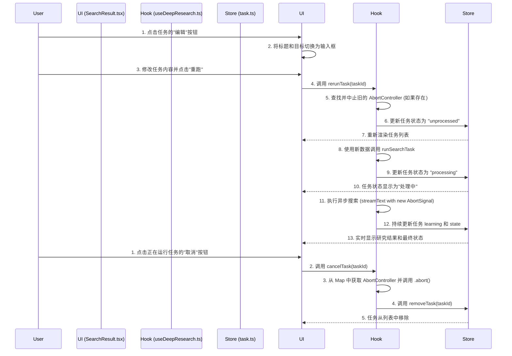

# 技术规划文档：可交互式搜索任务

本文档旨在为 `deep-research` 项目设计一套全新的"可交互式搜索任务"功能，以解决当前搜索任务流程僵化、缺乏用户实时交互能力的问题。

## 1. 现有搜索任务流程分析

当前的搜索任务流程以 `useDeepResearch` hook 中的 `runSearchTask` 函数为核心，具体流程如下：

1.  **触发**: 用户在界面上定义研究任务后，相关的组件（如 `SearchResult.tsx`）会调用 `runSearchTask`，并传入一个 `SearchTask` 对象数组。
2.  **状态管理**:
    *   `runSearchTask` 函数开始执行后，会立即通过 `taskStore.updateTask` 将任务的 `state` 更新为 `"processing"`。
    *   任务的核心逻辑是调用 `ai` 库的 `streamText` 函数，这是一个异步的流式文本生成过程。
    *   在流式数据返回过程中，`learning` 字段会被持续更新到 `taskStore` 中，以实现前端内容的实时展示。
    *   任务完成后（无论成功或失败），`state` 会被更新为 `"completed"` 或 `"failed"`。
3.  **核心问题**:
    *   **不可中断**: 一旦 `runSearchTask` 内部的 `Promise`（特别是 `streamText` 调用）开始执行，就没有内置的机制可以从外部中断它。
    *   **不可编辑**: `SearchTask` 的 `query` 和 `researchGoal` 等核心属性在任务开始后无法修改。`updateTask` 是基于 `query` 来查找并更新任务的，如果 `query` 本身被修改，将导致状态更新逻辑失效。
    *   **无等待机制**: 任务一旦被触发，会立即进入执行阶段，用户没有机会在任务开始前进行检查或确认。

## 2. 新功能架构设计提案

为了实现可交互性，我们将引入任务 ID、新的任务状态、可中止的异步逻辑和全局等待设置。

### 2.1. 引入稳定的任务 ID

当前使用 `query` 作为任务标识符，这在 `query` 可编辑后会失效。我们需要为每个 `SearchTask` 引入一个唯一的、不可变的 ID。

*   **方案**: 在 `SearchTask` 类型中增加一个 `id: string` 字段。
*   **实现**: 在创建 `SearchTask` 实例时，使用 `nanoid` 或类似库生成一个唯一ID。所有后续的增删改查操作（`updateTask`, `removeTask`）都将基于这个 `id`，而不是 `query`。

### 2.2. 扩展任务状态 (Task State)

为了支持等待和取消功能，我们需要在现有的 `state` 字段中增加两个新状态：

*   `"waiting"`: 表示任务已创建，正在等待用户确认或等待超时后自动执行。
*   `"cancelled"`: 表示任务已被用户手动取消。

新的任务生命周期将是：`unprocessed` -> `waiting` (可选) -> `processing` -> `completed` / `failed`。用户可以在任何阶段将其转为 `cancelled`。

### 2.3. 实现任务中止 (Cancellation)

我们将利用 `AbortController` 来实现异步任务的中止。

*   **管理 `AbortController`**: 在 `useDeepResearch` hook 内部，维护一个 `Map` 对象，用于存储每个正在运行的任务 ID 与其对应的 `AbortController` 实例，例如 `const taskControllers = new Map<string, AbortController>()`。这个 Map 不存入 Zustand store，因为它包含非可序列化的 `AbortController`。
*   **传递 `AbortSignal`**: 在调用 `runSearchTask` 时，为每个任务创建一个 `AbortController` 实例，并将其 `signal` 传入 `streamText` 函数（`ai` 库支持此参数）。
*   **触发中止**: 当用户点击"取消"按钮时，会调用一个新的函数（例如 `cancelTask(taskId: string)`）。该函数会从 `Map` 中找到对应的 `controller`，调用 `controller.abort()`，然后将任务状态更新为 `"cancelled"` 并从列表中移除。

### 2.4. 全局超时与等待机制

*   **设置存储**: 在 `src/store/setting.ts` 的 `SettingStore` 中增加两个新字段：
    *   `enableTaskWaitingTime: boolean`
    *   `taskWaitingTime: number` (单位：秒)
*   **UI 实现**: 在 `Setting.tsx` 组件中添加相应的开关和输入框，允许用户配置这两个值。
*   **逻辑实现**: 在 `runSearchTask` 的开始阶段，检查 `enableTaskWaitingTime` 是否为 `true`。
    *   如果为 `true`，则不直接开始任务，而是将任务状态设置为 `"waiting"`，并启动一个 `setTimeout` 计时器。
    *   计时器触发后，任务状态自动变为 `"processing"` 并开始执行。
    *   在 `waiting` 状态下，UI 上应显示一个"立即开始"按钮，点击后会清除计时器并立即开始任务。
    *   计时器的 ID 也需要与任务关联，以便在用户"立即开始"或"取消"时能通过 `clearTimeout` 清除它。

### 2.5. 实时编辑与重跑

*   **UI 交互**: 在 `SearchResult.tsx` 中，为每个任务项添加一个"编辑"按钮。点击后，`title` 和 `researchGoal` 变为可编辑的文本域，并显示"保存"和"取消编辑"按钮。
*   **状态更新**: "保存"按钮会调用 `updateTask(id, { title, researchGoal })` 来更新 `taskStore` 中的数据。
*   **重跑逻辑**: "重新执行"按钮将触发 `rerunTask(taskId: string)` 函数。
    1.  首先，调用 `cancelTask(taskId)` 确保任何正在运行的旧实例被中止。
    2.  然后，将该任务的状态重置为 `unprocessed`。
    3.  最后，使用更新后的任务数据重新调用 `runSearchTask`。

## 3. 新的工作流程图 (Mermaid)

## 4. 文件修改清单 (File-by-File Modification Plan)

### `src/types.d.ts`

*   [ ] 在 `SearchTask` 接口中添加 `id: string` 字段。
*   [ ] 扩展 `SearchTask["state"]` 类型，加入 `'waiting'` 和 `'cancelled'`。
*   [ ] (可选) 添加 `timerId?: number` 用于跟踪 `setTimeout`。

### `src/store/setting.ts`

*   [ ] 在 `SettingStore` 接口中添加 `enableTaskWaitingTime: boolean`。
*   [ ] 在 `SettingStore` 接口中添加 `taskWaitingTime: number`。
*   [ ] 在 `defaultValues` 对象中为上述两个新字段提供默认值 (e.g., `false` 和 `10`)。

### `src/store/task.ts`

*   [ ] 修改 `updateTask` 和 `removeTask` 函数，使其接受 `id: string` 而不是 `query: string` 作为参数。
*   [ ] 新增一个 `addTask(task: Omit<SearchTask, 'id' | 'state'>): SearchTask` 函数，用于在内部生成 ID 和设置初始状态，并将其添加到 `tasks` 数组中。
*   [ ] 确保所有调用 `updateTask` 和 `removeTask` 的地方都已更新为使用 `id`。

### `src/hooks/useDeepResearch.ts`

*   [ ] 在 `useDeepResearch` hook 的顶层作用域创建一个 `const taskControllers = new Map<string, AbortController>()`。
*   [ ] **修改 `runSearchTask`**:
    *   在函数开始时，从 `useSettingStore` 获取 `enableTaskWaitingTime` 和 `taskWaitingTime`。
    *   对于每个要运行的任务，检查是否需要进入 `waiting` 状态。
    *   如果需要等待：
        *   调用 `updateTask(task.id, { state: 'waiting' })`。
        *   使用 `setTimeout` 启动计时器。在回调中，将任务状态更新为 `processing` 并执行核心搜索逻辑。
        *   存储 `timeoutId` 以便可以被清除。
    *   在执行核心搜索逻辑时：
        *   创建一个 `const controller = new AbortController()`。
        *   将 `controller` 存入 `taskControllers.set(task.id, controller)`。
        *   将 `signal: controller.signal` 传递给 `streamText` 调用。
        *   在 `finally` 或 `catch` 块中，确保从 `taskControllers` 中删除已完成或失败的任务 `taskControllers.delete(task.id)`。
*   [ ] **新增 `cancelTask(taskId: string)`**:
    *   从 `taskControllers` 获取 `controller` 并调用 `controller.abort()`。
    *   从 `Map` 中删除该条目 `taskControllers.delete(taskId)`。
    *   调用 `removeTask(taskId)` 从 store 中删除任务。
*   [ ] **新增 `rerunTask(taskId: string)`**:
    *   调用 `cancelTask(taskId)` 来停止当前任务。
    *   重置任务状态并重新调用 `runSearchTask`。

### `src/components/Research/SearchResult.tsx`

*   [ ] 引入一个新的 state 用于管理哪个任务正在被编辑，例如 `const [editingTaskId, setEditingTaskId] = useState<string | null>(null)`。
*   [ ] 在 `map` 循环中，将 `key` 从 `idx` 或 `item.query` 修改为 `item.id`。
*   [ ] **修改任务渲染逻辑**:
    *   如果 `editingTaskId === item.id`，则渲染 `title` 和 `researchGoal` 的 `<input>` 和 `<textarea>`。
    *   否则，渲染普通文本。
*   [ ] **添加/修改交互按钮**:
    *   添加"编辑"按钮，点击后调用 `setEditingTaskId(item.id)`。
    *   添加"保存"按钮（仅在编辑模式下显示），点击后调用 `updateTask` 并通过 `setEditingTaskId(null)` 退出编辑模式。
    *   修改"删除"按钮 (`handleRemove`) 的逻辑，使其调用新的 `cancelTask(item.id)`。
    *   修改"重试"按钮 (`handleRetry`) 的逻辑，使其成为新的"重跑"功能，并调用 `rerunTask(item.id)`。
*   [ ] **处理 `waiting` 状态**:
    *   当 `item.state === 'waiting'` 时，在 `TaskState` 组件中显示一个特定的图标（如沙漏）。
    *   在任务项旁边显示剩余等待时间和"立即开始"按钮。

### `src/components/Setting.tsx`

*   [ ] 添加 UI 控件（Switch 和 InputNumber）来让用户配置 `enableTaskWaitingTime` 和 `taskWaitingTime`。
*   [ ] 将这些控件的状态与 `useSettingStore` 同步。

完成了这份详细的规划，我们就有了一张清晰的地图，可以指导后续的开发工作，确保新功能能够高质量、高效率地交付。 