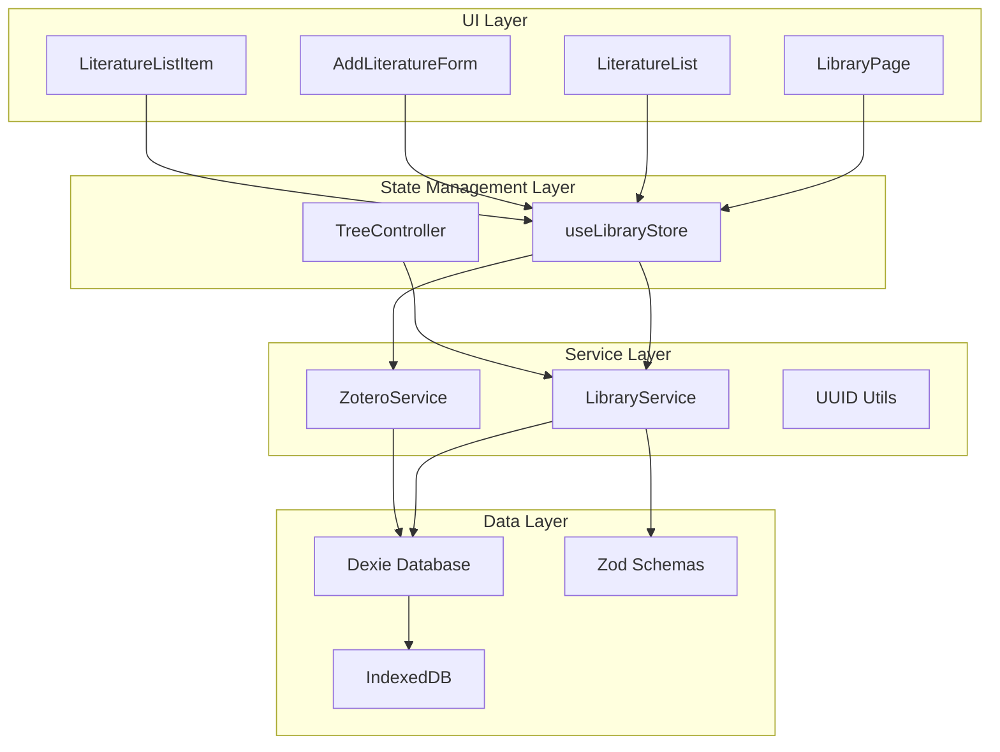
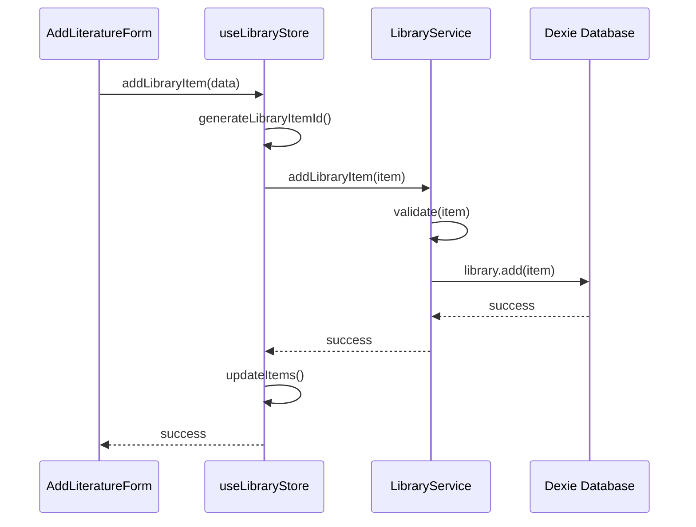
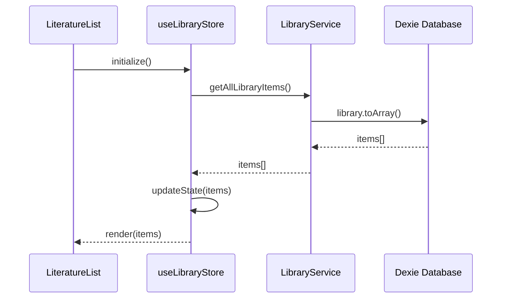

# 文献管理系统架构说明

## 🏗️ 系统架构概览

## 📋 各层职责分工

### 🎨 UI Layer (展示层)
**位置**: `src/app/library/`, `src/components/Library/`

**职责**:
- 用户界面渲染
- 用户交互处理
- 表单验证
- 数据展示

**核心组件**:
- `LibraryPage`: 主页面容器
- `LiteratureList`: 文献列表展示
- `AddLiteratureForm`: 添加文献表单
- `LiteratureListItem`: 单个文献项

### 🔄 State Management Layer (状态管理层)
**位置**: `src/store/libraryStore.ts`, `src/libs/tree/TreeController.ts`

**职责**:
- 全局状态管理
- 业务逻辑协调
- 数据流控制
- 错误处理

**核心功能**:
- `useLibraryStore`: 文献状态管理
- `TreeController`: MCTS树算法控制

### 🛠️ Service Layer (服务层)
**位置**: `src/libs/db/`, `src/libs/zotero/`, `src/libs/utils/`

**职责**:
- 业务逻辑实现
- 数据处理
- 外部服务集成
- 工具函数提供

**核心服务**:
- `LibraryService`: 文献数据服务
- `ZoteroService`: Zotero集成服务
- `UUID Utils`: ID生成工具

### 💾 Data Layer (数据层)
**位置**: `src/libs/db/index.ts`, `src/libs/db/schema.ts`

**职责**:
- 数据持久化
- 数据模型定义
- 数据验证
- 索引管理

**核心组件**:
- `Dexie Database`: 数据库抽象层
- `Zod Schemas`: 数据验证模式
- `IndexedDB`: 浏览器本地存储

## 🔄 数据流向

### 添加文献流程

### 查询文献流程

## 🎯 已实现功能

### ✅ 完整实现
- 文献添加、编辑、删除
- 实时搜索和筛选
- 来源分类管理
- 数据持久化
- 类型安全验证
- 响应式UI

### ⚠️ 部分实现
- **Zotero集成**: 后端完成，UI待完善
- **文献树**: 基础架构完成，会话绑定待实现
- **翻页功能**: UI占位符存在，逻辑待实现

### ❌ 未实现
- 文献去重机制
- 批量操作完整实现
- 高级搜索功能
- 导出功能完整实现

## 🔧 技术特点

### 优势
- **分层清晰**: 严格遵循分层架构
- **类型安全**: 完整TypeScript支持
- **响应式**: Zustand状态管理
- **可扩展**: 模块化设计
- **离线支持**: IndexedDB本地存储

### 架构原则
- **单一职责**: 每层专注特定功能
- **依赖注入**: 服务层解耦
- **数据验证**: 多层验证机制
- **错误处理**: 统一错误处理策略

## 📈 后续优化方向

### 高优先级
1. **文献去重机制**
2. **翻页功能实现**
3. **Zotero UI完善**

### 中优先级
1. **会话绑定完善**
2. **性能优化**
3. **错误处理统一**

### 低优先级
1. **高级搜索**
2. **批量操作**
3. **导出功能**

---

**更新时间**: 2024-01-XX
**维护者**: Architecture Team