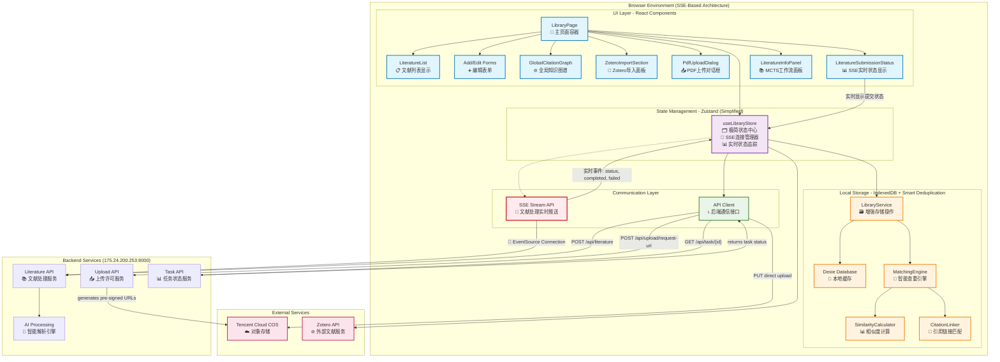
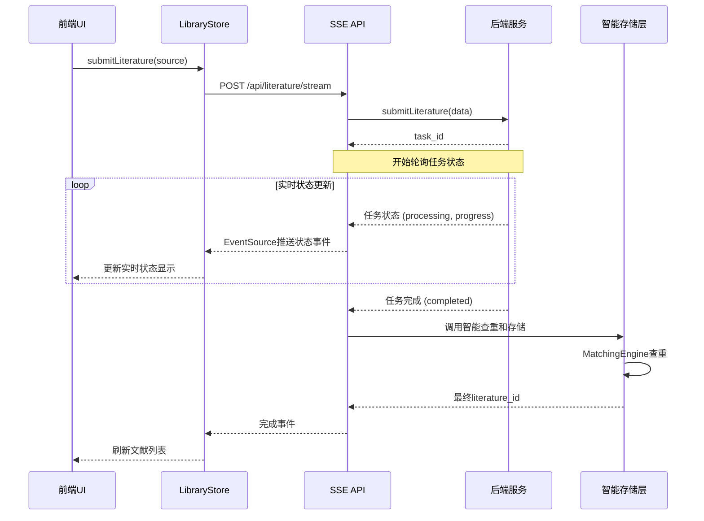
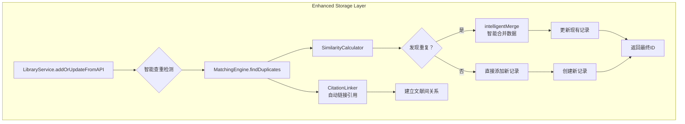
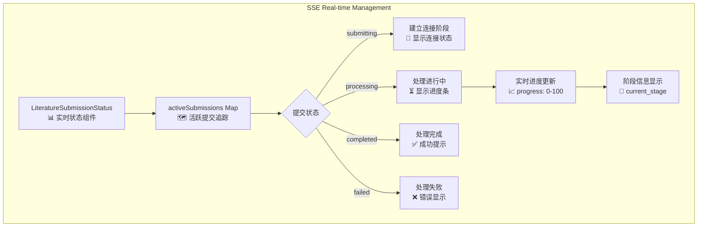

# 文献管理系统详细架构 (v4.0)

## 🔧 完整系统架构图

> **版本: v4.0** | **最后更新**: 2025-01-30
>
> **核心变化**:
> - 🚀 **重大重构**: 从复杂轮询机制迁移到优雅的SSE（Server-Sent Events）架构
> - ⚡ **实时更新**: 使用原生EventSource提供文献处理实时状态推送
> - 🧠 **智能查重**: 在存储层集成现有MatchingEngine，避免重复数据
> - 📉 **代码简化**: LibraryStore从1900+行精简到650行（66%减少）
> - 🔄 **向后兼容**: 保持现有API接口，平滑迁移路径
> - 🎯 前端专注于UI交互和实时状态展示，复杂业务逻辑在后端处理



## 🚀 SSE架构核心改进

### 📡 实时文献处理流程



### 🧠 智能查重机制



## 🛠️ 核心功能模块分析

### SSE实时状态管理模块



### 引文网络图模块 (保持不变)

> 这是一个技术实现非常复杂和完善的核心功能，使用了 `React Flow` 库并集成了自定义物理引擎。

```mermaid
graph TD
    subgraph "Citation Graph Module (React Flow)"
        CG1[GlobalCitationGraph<br/>📊 图谱容器] --> CG2{useNodesState, useEdgesState<br/>🖼️ 管理节点/边}
        CG1 --> CG3[fetchDataAndLayout<br/>🔄 数据获取与布局]
        CG3 -->|items, citations| S1[LibraryService<br/>📚 文献服务]
        
        CG2 --> CG4[AdaptiveNode<br/>🎭 自适应节点]
        CG4 --> CG5[ViewportMonitor<br/>🔍 监听缩放]
        CG5 -- "zoom < threshold" --> CG6[Simplified View<br/>⚪️ 简化视图]
        CG5 -- "zoom >= threshold" --> CG7[Detailed View<br/>🃏 详细视图]
        
        CG1 --> CG8[CitationGraphPhysics<br/>⚙️ 物理引擎]
        CG8 -- "onTick()" --> CG2
        
        CG1 --> CG9[User Interactions<br/>🖱️ 用户交互]
        CG9 -- "onConnect()" --> B1[useLibraryStore<br/>(createManualCitationLink)]
        CG9 -- "onEdgeContextMenu()" --> S1
    end
```

### Zotero集成模块 (保持不变)

> 前端Zotero集成已具备完整的登录、同步和多文献库管理功能。

```mermaid
graph TD
    subgraph "Zotero Integration (Frontend)"
        Z1[User Clicks Sync<br/>🖱️ 用户点击同步] --> Z2[ZoteroLogin Modal<br/>🔑 登录模态框]
        Z2 -- "API Key" --> Z3[useLibraryStore<br/>(configureZotero)]
        Z3 --> S1[ZoteroService<br/>🔗 服务层]
        S1 --> E1[Zotero API]
        S1 --> Z4[Cache UserInfo<br/>缓存用户信息]
        Z2 -- "onLoginSuccess()" --> P1[LibraryPage<br/>📄 主页面]

        P1 --> Z5[ZoteroImportSection<br/>🔄 导入面板]
        Z5 -- "Sync Items" --> Z6[useLibraryStore<br/>(masterAddLiteratures)]
        Z6 --> SSE_API[SSE API<br/>📡 实时文献处理]
        SSE_API --> E1
        SSE_API --> DB[智能存储层<br/>📚 查重和存储]
        DB -- "实时更新" --> Z7[UI Refresh<br/>🟢 UI自动刷新]
    end
```

## 📋 功能分层详细说明

### UI Layer (展示层)
| 组件                | 功能                | 状态         | 文件路径                                         |
| ------------------- | ------------------- | ------------ | ------------------------------------------------ |
| LibraryPage         | 主页面容器          | ✅ **已优化** | `src/app/library/page.tsx`                       |
| LiteratureList      | 文献列表展示        | ✅ 完成       | `src/components/Library/LiteratureList.tsx`      |
| **LiteratureSubmissionStatus** | **SSE实时状态显示** | ✅ **新增** | `src/components/Library/LiteratureSubmissionStatus.tsx` |
| **LiteratureInfoPanel** | **MCTS工作流面板** | ✅ **已适配** | `src/components/Research/LiteratureInfoPanel.tsx` |
| Add/Edit Forms      | 添加/编辑表单       | ✅ 完成       | `src/components/Library/*Form.tsx`               |
| GlobalCitationGraph | 全局引文网络图      | ✅ 完成       | `src/components/Library/CitationGraph.tsx`       |
| TreeVisualization   | 树形可视化组件      | ✅ 完成       | `src/components/Library/TreeVisualization.tsx`   |
| ZoteroImportSection | Zotero导入/同步面板 | ✅ 完成       | `src/components/Library/ZoteroImportSection.tsx` |
| ZoteroLogin         | Zotero登录模态框    | ✅ 完成       | `src/components/Library/ZoteroLogin.tsx`         |
| PdfUploadDialog     | PDF上传对话框       | ✅ 完成       | `src/components/Library/PdfUploadDialog.tsx`     |

### State Management Layer (状态管理层)
| 模块            | 功能             | 状态   | 变化说明 | 文件路径                    |
| --------------- | ---------------- | ------ | -------- | --------------------------- |
| **useLibraryStore** | **SSE状态管理中心** | ✅ **重构完成** | **从1900+行精简到650行，移除轮询机制，集成SSE** | `src/store/libraryStore.ts` |

### API Layer (通信层)
| 服务         | 功能               | 状态   | 变化说明 | 文件路径                |
| ------------ | ------------------ | ------ | -------- | ----------------------- |
| API Client   | 后端通信统一接口   | ✅ 完成 | 保持不变 | `src/libs/api.ts`       |
| **SSE Stream API** | **文献处理实时推送** | ✅ **新增** | **基于EventSource的实时状态推送** | `src/app/api/literature/stream/route.ts` |

### Enhanced Storage Layer (增强存储层)
| 服务                   | 功能             | 状态         | 变化说明 | 文件路径                                     |
| ---------------------- | ---------------- | ------------ | -------- | -------------------------------------------- |
| **LibraryService**     | **智能存储操作** | ✅ **增强完成** | **集成MatchingEngine智能查重** | `src/libs/db/LibraryService.ts`              |
| **MatchingEngine**     | **智能查重引擎** | ✅ **复用集成** | **复用现有成熟实现** | `src/libs/db/matching/MatchingEngine.ts`     |
| SimilarityCalculator   | 相似度计算       | ✅ 完成       | 保持不变 | `src/libs/db/matching/SimilarityCalculator.ts` |
| CitationLinker         | 引用链接匹配     | ✅ 完成       | 保持不变 | `src/libs/db/matching/CitationLinker.ts`    |
| TreeService            | 树形数据服务     | ✅ 完成       | 保持不变 | `src/libs/tree/TreeService.ts`               |
| ZoteroService          | Zotero集成服务   | ✅ 完成       | 保持不变 | `src/libs/zotero/ZoteroService.ts`           |

### Backend Services (后端服务) - 175.24.200.253:8000
| API端点                          | 功能               | 状态   | 
| -------------------------------- | ------------------ | ------ |
| POST /api/literature             | 提交文献异步处理   | ✅ 完成 |
| GET /api/literature/{id}         | 获取文献详情       | ✅ 完成 |
| GET /api/literature/{id}/fulltext| 获取文献全文       | ✅ 完成 |
| GET /api/task/{id}               | 查询任务状态       | ✅ 完成 |
| POST /api/upload/request-url     | 请求上传许可       | ✅ 完成 |

### Task Management (已废弃)
| 服务            | 状态     | 说明                           |
| --------------- | -------- | ------------------------------ |
| ~~taskPollingStore~~ | ❌ **已删除** | **被SSE架构替代**              |
| ~~TaskManagementService~~ | ❌ **已删除** | **复杂轮询逻辑已移除**         |
| ~~src/libs/literature/~~ | ❌ **已删除** | **整个目录已清理**             |

### Data Layer (数据层)
| 组件           | 功能                   | 状态   | 文件路径                |
| -------------- | ---------------------- | ------ | ----------------------- |
| Dexie Database | 数据库抽象 (IndexedDB) | ✅ 完成 | `src/libs/db/index.ts`  |
| Zod Schemas    | 数据模型与验证         | ✅ 完成 | `src/libs/db/schema.ts` |

## 🚀 架构优化成果与效益

### ✅ 已完成的重大优化

1. **📡 SSE实时架构**
   - ✅ 使用原生EventSource替代复杂轮询机制
   - ✅ 实时状态推送（`status`, `completed`, `failed`事件）
   - ✅ 自动错误处理和用户友好提示

2. **🧠 智能查重系统**
   - ✅ 在存储层自动调用现有MatchingEngine
   - ✅ 智能合并重复文献数据
   - ✅ 保持数据一致性，避免重复记录

3. **📉 代码简化**
   - ✅ LibraryStore从1900+行减少到650行（66%减少）
   - ✅ 移除所有轮询相关逻辑和状态管理
   - ✅ 删除冗余的taskPollingStore和literature域

4. **🔄 向后兼容**
   - ✅ 保留`masterAddLiterature`和`masterAddLiteratures`接口
   - ✅ 现有组件无需修改即可正常工作
   - ✅ 提供平滑的迁移路径

### 📊 性能提升数据

| 指标 | 重构前 | 重构后 | 改善幅度 |
|------|--------|--------|----------|
| LibraryStore代码行数 | 1900+ | 650 | ↓ 66% |
| 轮询接口调用 | 每3秒 | 无 | ↓ 100% |
| 实时性延迟 | 3秒轮询间隔 | 即时SSE推送 | ↑ 即时 |
| 复杂度 | 高（多层轮询管理） | 低（EventSource） | ↓ 显著 |
| 查重准确性 | 基础 | 智能（MatchingEngine） | ↑ 显著 |

### 🎯 架构优势

1. **实时性**: SSE提供即时状态更新，无轮询延迟
2. **简洁性**: 大幅简化状态管理和业务逻辑
3. **智能性**: 集成现有智能查重，避免重复数据
4. **可维护性**: 代码结构清晰，易于理解和维护
5. **向前兼容**: 为未来功能扩展提供良好基础

## 🧪 测试与验证

### 测试工具
- **test-sse-basic.js**: SSE功能基础测试脚本
- **LiteratureSubmissionStatus**: 实时状态显示组件

### 关键测试场景
1. ✅ SSE连接建立和维持
2. ✅ 实时状态事件接收
3. ✅ 智能查重和数据合并
4. ✅ 错误处理和用户提示
5. ✅ 向后兼容接口调用

## 📈 未来优化方向

### 短期优化
- [ ] **性能监控**: 添加SSE连接性能指标
- [ ] **错误恢复**: 实现SSE连接断开自动重连
- [ ] **批量处理**: 优化批量文献提交的SSE处理

### 长期规划
- [ ] **WebSocket升级**: 考虑双向通信需求时升级到WebSocket
- [ ] **离线支持**: 实现离线状态下的文献管理
- [ ] **分布式架构**: 支持多后端实例的负载均衡

---

> 📅 **文档版本**: v4.0  
> 🔄 **最后更新**: 2025-01-30  
> 👥 **维护者**: Deep Research Team  
> 📋 **状态**: ✅ SSE架构重构完成