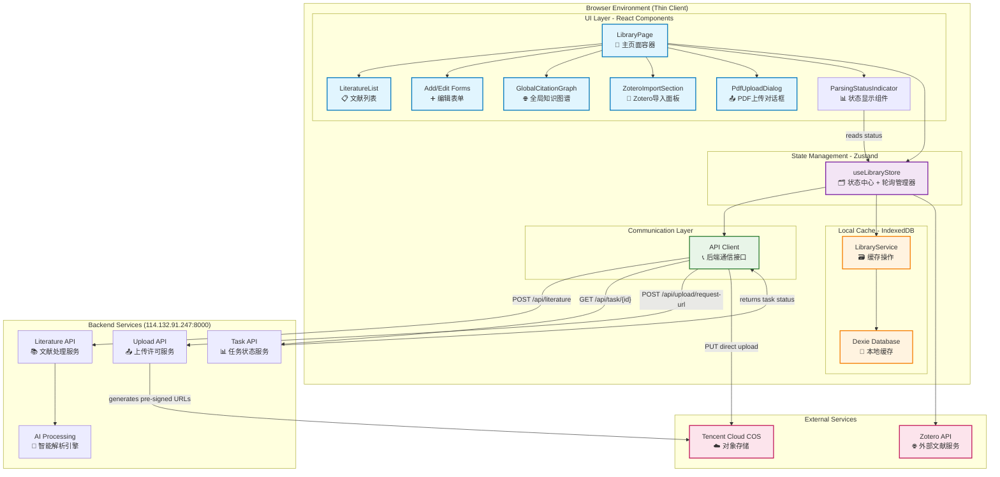
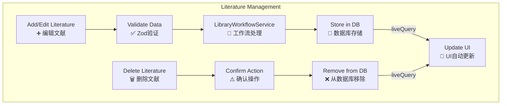
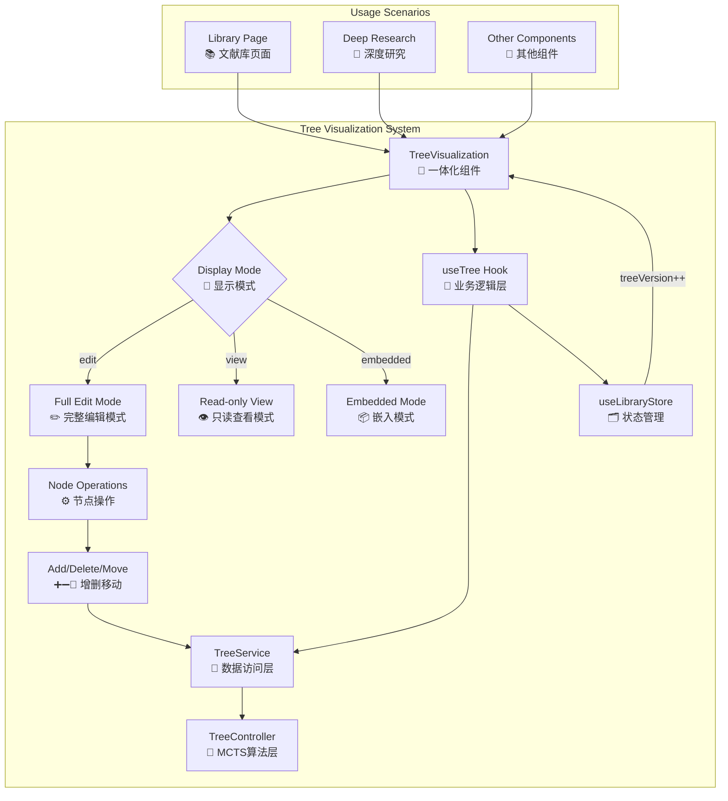

# 文献管理系统详细架构 (v3.0)

## 🔧 完整系统架构图

> **版本: v3.0** | **最后更新**: 2024-01-15
>
> **核心变化**:
> - 🚀 重大重构：前端从"胖客户端"转变为"瘦客户端"
> - ☁️ 所有复杂的解析业务逻辑迁移到后端服务 (114.132.91.247:8000)
> - 📤 实现OSS直传功能，使用腾讯云COS存储PDF文件
> - 🔄 采用轮询机制替代SSE，监听异步任务状态
> - 🎯 前端专注于UI交互和状态展示，业务逻辑集中在后端



## 🛠️ 核心功能模块分析

### 引文网络图模块 (Citation Graph)

> 这是一个技术实现非常复杂和完善的核心功能，使用了 `React Flow` 库并集成了自定义物理引擎。

```mermaid
graph TD
    subgraph "Citation Graph Module (React Flow)"
        CG1[GlobalCitationGraph<br/>📊 图谱容器] --> CG2{useNodesState, useEdgesState<br/>🖼️ 管理节点/边}
        CG1 --> CG3[fetchDataAndLayout<br/>🔄 数据获取与布局]
        CG3 -->|items, citations| S1[LibraryService<br/>📚 文献服务]
        
        CG2 --> CG4[AdaptiveNode<br/>🎭 自适应节点]
        CG4 --> CG5[ViewportMonitor<br/>🔍 监听缩放]
        CG5 -- "zoom < threshold" --> CG6[Simplified View<br/>⚪️ 简化视图]
        CG5 -- "zoom >= threshold" --> CG7[Detailed View<br/>🃏 详细视图]
        
        CG1 --> CG8[CitationGraphPhysics<br/>⚙️ 物理引擎]
        CG8 -- "onTick()" --> CG2
        
        CG1 --> CG9[User Interactions<br/>🖱️ 用户交互]
        CG9 -- "onConnect()" --> B1[useLibraryStore<br/>(createManualCitationLink)]
        CG9 -- "onEdgeContextMenu()" --> S1
    end
```

### Zotero集成模块 (Frontend)

> 前端Zotero集成已具备完整的登录、同步和多文献库管理功能。

```mermaid
graph TD
    subgraph "Zotero Integration (Frontend)"
        Z1[User Clicks Sync<br/>🖱️ 用户点击同步] --> Z2[ZoteroLogin Modal<br/>🔑 登录模态框]
        Z2 -- "API Key" --> Z3[useLibraryStore<br/>(configureZotero)]
        Z3 --> S1[ZoteroService<br/>🔗 服务层]
        S1 --> E1[Zotero API]
        S1 --> Z4[Cache UserInfo<br/>缓存用户信息]
        Z2 -- "onLoginSuccess()" --> P1[LibraryPage<br/>📄 主页面]

        P1 --> Z5[ZoteroImportSection<br/>🔄 导入面板]
        Z5 -- "Sync Items" --> Z6[useLibraryStore<br/>(syncWithZotero)]
        Z6 --> S1
        S1 -- "fetches items" --> E1
        S1 -- "compares & adds" --> DB[LibraryService<br/>📚 本地数据库]
        DB -- "liveQuery" --> Z7[UI Refresh<br/>🟢 UI自动刷新]
    end
```

### 文献管理模块


### 树形数据结构模块 (Tree Visualization System)

> 🌳 **设计理念**: 即插即用的树形可视化组件，支持多场景使用和一体化编辑功能。



## 📋 功能分层详细说明

### UI Layer (展示层)
| 组件                | 功能                | 状态         | 文件路径                                         |
| ------------------- | ------------------- | ------------ | ------------------------------------------------ |
| LibraryPage         | 主页面容器          | 🟡 **待重构** | `src/app/library/page.tsx`                       |
| LiteratureList      | 文献列表展示        | ✅ 完成       | `src/components/Library/LiteratureList.tsx`      |
| Add/Edit Forms      | 添加/编辑表单       | ✅ 完成       | `src/components/Library/*Form.tsx`               |
| GlobalCitationGraph | 全局引文网络图      | ✅ 完成       | `src/components/Library/CitationGraph.tsx`       |
| **TreeVisualization** | **树形可视化组件**    | 🚧 **开发中** | `src/components/Library/TreeVisualization.tsx`   |
| **TreeSelector**      | **树选择器组件**      | 🚧 **开发中** | `src/components/Library/TreeSelector.tsx`        |
| ZoteroImportSection | Zotero导入/同步面板 | ✅ 完成       | `src/components/Library/ZoteroImportSection.tsx` |
| ZoteroLogin         | Zotero登录模态框    | ✅ 完成       | `src/components/Library/ZoteroLogin.tsx`         |
| PdfUploadDialog     | PDF上传对话框       | ✅ 完成       | `src/components/Library/PdfUploadDialog.tsx`     |

### State Management Layer (状态管理层)
| 模块            | 功能             | 状态   | 文件路径                    |
| --------------- | ---------------- | ------ | --------------------------- |
| useLibraryStore | 文献状态管理中心 | ✅ 完成 | `src/store/libraryStore.ts` |

### Hook Layer (业务逻辑封装层)
| Hook            | 功能             | 状态   | 文件路径                    |
| --------------- | ---------------- | ------ | --------------------------- |
| useCitations    | 引文关系管理     | ✅ 完成 | `src/hooks/useCitations.ts` |
| **useTree**     | **树操作管理**   | 🚧 **开发中** | `src/hooks/useTree.ts`      |
| useZotero       | Zotero集成管理   | ✅ 完成 | `src/hooks/useZotero.ts`    |

### Communication Layer (通信层)
| 服务         | 功能               | 状态   | 文件路径                |
| ------------ | ------------------ | ------ | ----------------------- |
| API Client   | 后端通信统一接口   | ✅ 完成 | `src/libs/api.ts`       |

### Local Service Layer (本地服务层)
| 服务                   | 功能             | 状态         | 文件路径                                     |
| ---------------------- | ---------------- | ------------ | -------------------------------------------- |
| LibraryService         | 本地缓存操作     | ✅ 完成       | `src/libs/db/LibraryService.ts`              |
| **TreeService**        | **树形数据服务** | 🚧 **开发中** | `src/libs/tree/TreeService.ts`               |
| **TreeWorkflowService** | **树操作工作流** | 🚧 **开发中** | `src/libs/tree/TreeWorkflowService.ts`       |
| ZoteroService          | Zotero集成服务   | ✅ 完成       | `src/libs/zotero/ZoteroService.ts`           |

### Backend Services (后端服务) - 114.132.91.247:8000
| API端点                          | 功能               | 状态   | 
| -------------------------------- | ------------------ | ------ |
| POST /api/literature             | 提交文献异步处理   | ✅ 完成 |
| GET /api/literature/{id}         | 获取文献详情       | ✅ 完成 |
| GET /api/literature/{id}/fulltext| 获取文献全文       | ✅ 完成 |
| GET /api/task/{id}               | 查询任务状态       | ✅ 完成 |
| POST /api/upload/request-url     | 请求上传许可       | ✅ 完成 |

### Data Layer (数据层)
| 组件           | 功能                   | 状态   | 文件路径                |
| -------------- | ---------------------- | ------ | ----------------------- |
| Dexie Database | 数据库抽象 (IndexedDB) | ✅ 完成 | `src/libs/db/index.ts`  |
| Zod Schemas    | 数据模型与验证         | ✅ 完成 | `src/libs/db/schema.ts` |

## 🚀 架构优化与待办事项

### 🎯 架构优化规划 (高优先级)
- **[ ] 重构 `LibraryPage.tsx` 组件**:
    - **目标**: 将其从一个臃肿的“上帝组件”转变为一个纯粹的UI布局容器。
    - **步骤1**: 创建 `useZotero.ts` 自定义Hook，将所有Zotero相关的状态逻辑 (`useState`, `useEffect`) 从 `LibraryPage` 移入该Hook。
    - **步骤2**: 在 `LibraryPage` 中使用 `const { ... } = useZotero()` 来获取数据和方法，简化组件内部实现。
- **[ ] 完善 `useLibraryStore`**:
    - **目标**: 确保所有对数据库的写操作都通过 `store` 的 `actions` 进行，而不是从UI组件直接调用 `service`。
    - **步骤**: 将 `CitationGraph.tsx` 中直接调用 `libraryService.deleteCitationLink` 的逻辑移入 `useLibraryStore`，创建一个 `deleteCitationLink` 的 `action`。

### ⏳ 功能待办清单
- [ ] **文献去重机制**: 在导入新文献时，提供更智能的重复检测和合并建议。
- [ ] **高级搜索与过滤**: 实现基于作者、年份、标签等多维度的搜索。
- [🚧] **文献树可视化系统**: 实现即插即用的树形可视化组件，支持编辑和多场景使用。
  - [🚧] `TreeVisualization` - 一体化可视化编辑组件
  - [🚧] `TreeService` - 树形数据CRUD服务
  - [🚧] `useTree` Hook - 树操作业务逻辑封装
- [ ] **批量操作**: 完善批量删除、批量添加到文献树等功能。
- [ ] **导出功能**: 实现将文献库或特定文献导出为常见格式（如BibTeX）。
- [ ] **全局设置持久化**: 将 `autoExtractMetadata` 等设置存储到数据库，而非`localStorage`。