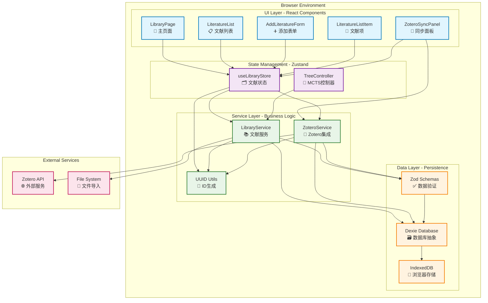
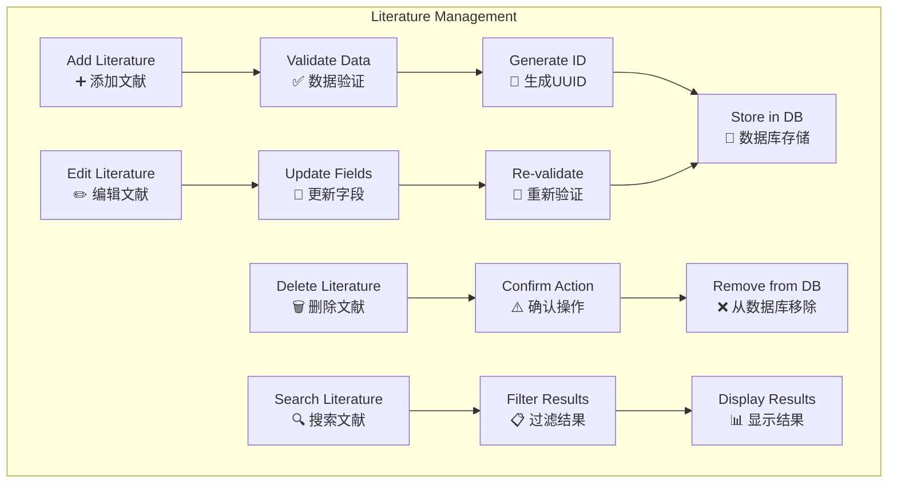
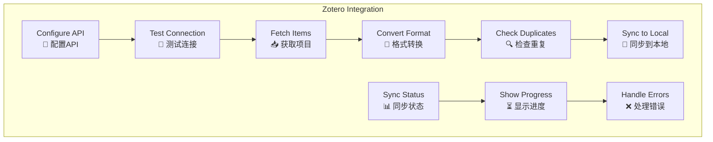

# 文献管理系统详细架构

## 🔧 完整系统架构图

## 🔄 数据流向详细分析

### 完整CRUD操作流程

```mermaid
graph LR
    subgraph "Create Flow"
        C1[UI Form] --> C2[Validate Input]
        C2 --> C3[Generate UUID]
        C3 --> C4[Store State]
        C4 --> C5[Service Layer]
        C5 --> C6[Zod Validation]
        C6 --> C7[Database Insert]
        C7 --> C8[Update UI]
    end
    
    subgraph "Read Flow"
        R1[UI Mount] --> R2[Store Initialize]
        R2 --> R3[Service Query]
        R3 --> R4[Database Query]
        R4 --> R5[Return Data]
        R5 --> R6[Update State]
        R6 --> R7[Render UI]
    end
    
    subgraph "Update Flow"
        U1[UI Edit] --> U2[Validate Changes]
        U2 --> U3[Store Update]
        U3 --> U4[Service Update]
        U4 --> U5[Database Update]
        U5 --> U6[Refresh State]
        U6 --> U7[Re-render]
    end
    
    subgraph "Delete Flow"
        D1[UI Delete] --> D2[Confirm Dialog]
        D2 --> D3[Store Delete]
        D3 --> D4[Service Delete]
        D4 --> D5[Database Delete]
        D5 --> D6[Remove from State]
        D6 --> D7[Update UI]
    end
```

## 🛠️ 核心功能模块

### 文献管理模块

### Zotero集成模块

## 📋 功能分层详细说明

### UI Layer (展示层)
| 组件 | 功能 | 状态 | 文件路径 |
|------|------|------|----------|
| LibraryPage | 主页面容器 | ✅ 完成 | `src/app/library/page.tsx` |
| LiteratureList | 文献列表展示 | ✅ 完成 | `src/components/Library/LiteratureList.tsx` |
| AddLiteratureForm | 添加文献表单 | ✅ 完成 | `src/components/Library/AddLiteratureForm.tsx` |
| LiteratureListItem | 单个文献项 | ✅ 完成 | `src/components/Library/LiteratureListItem.tsx` |
| ZoteroSyncPanel | Zotero同步面板 | ⚠️ 占位符 | `src/app/library/page.tsx` |

### State Management Layer (状态管理层)
| 模块 | 功能 | 状态 | 文件路径 |
|------|------|------|----------|
| useLibraryStore | 文献状态管理 | ✅ 完成 | `src/store/libraryStore.ts` |
| TreeController | MCTS树控制器 | ✅ 完成 | `src/libs/tree/TreeController.ts` |

### Service Layer (服务层)
| 服务 | 功能 | 状态 | 文件路径 |
|------|------|------|----------|
| LibraryService | 文献数据服务 | ✅ 完成 | `src/libs/db/LibraryService.ts` |
| ZoteroService | Zotero集成服务 | ⚠️ 后端完成 | `src/libs/zotero/ZoteroService.ts` |
| UUID Utils | ID生成工具 | ✅ 完成 | `src/libs/utils/uuid.ts` |

### Data Layer (数据层)
| 组件 | 功能 | 状态 | 文件路径 |
|------|------|------|----------|
| Dexie Database | 数据库抽象 | ✅ 完成 | `src/libs/db/index.ts` |
| Zod Schemas | 数据验证 | ✅ 完成 | `src/libs/db/schema.ts` |
| Data Constants | 常量定义 | ✅ 完成 | `src/libs/db/constants.ts` |

## 🎯 待完善功能清单

### 高优先级 (P0)
- [ ] 文献去重机制
- [ ] 翻页功能实现
- [ ] Zotero配置UI

### 中优先级 (P1)
- [ ] 会话绑定完善
- [ ] 批量操作完整实现
- [ ] 性能优化

### 低优先级 (P2)
- [ ] 高级搜索
- [ ] 导出功能
- [ ] 离线同步

---

**架构版本**: v1.0  
**最后更新**: 2024-01-XX  
**维护团队**: Development Team